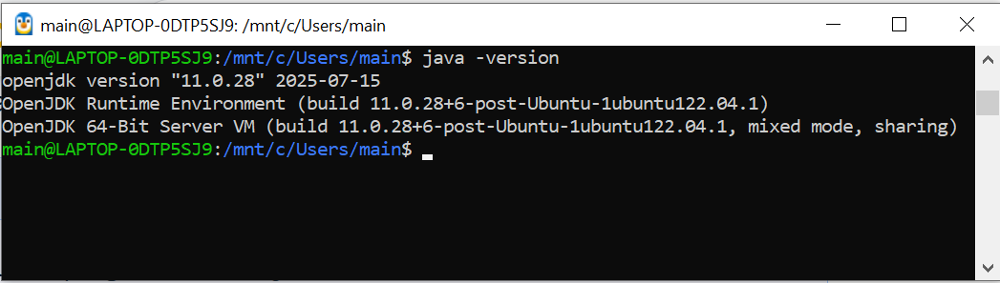
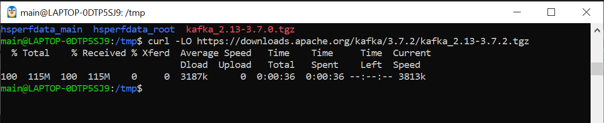
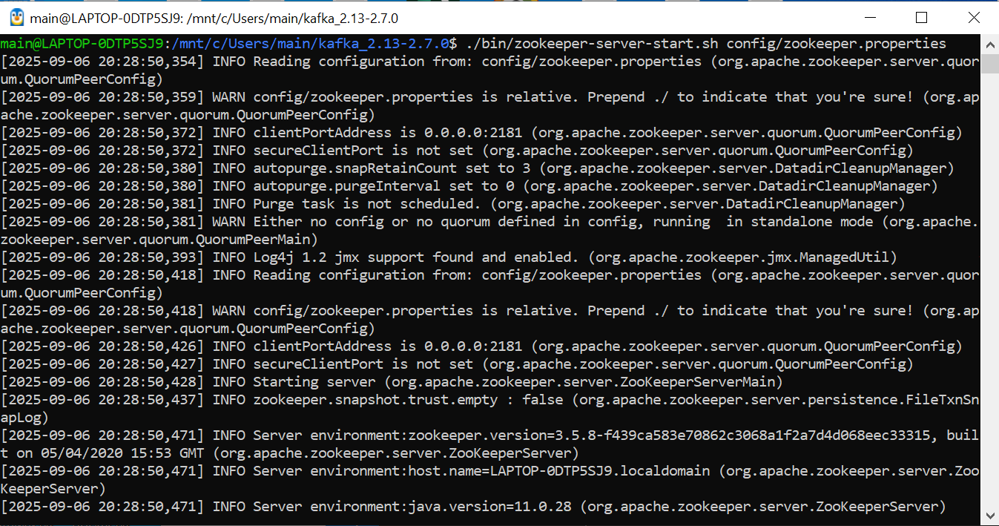
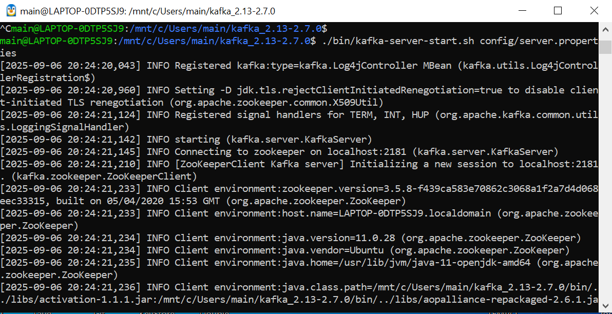
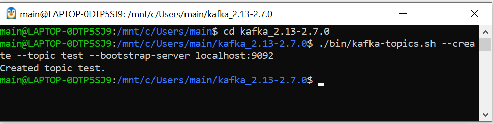
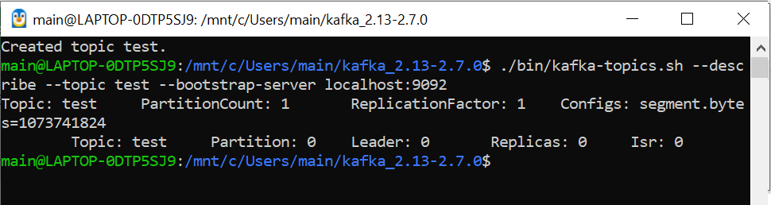
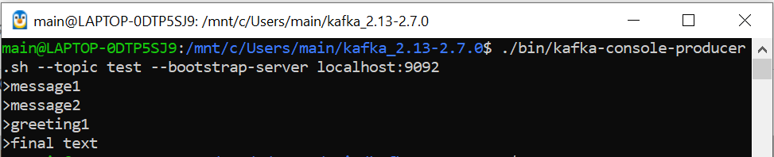
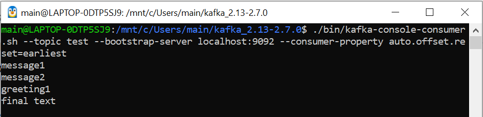

1. Устанавливаем JRE

sudo apt-get update

sudo apt install default-jre

2. Качаем кафку с apache.org

wget https://archive.apache.org/dist/kafka/2.7.0/kafka_2.13-2.7.0.tgz
tar -xzf kafka_2.13-2.7.0.tgz
cd kafka_2.13-2.7.0

3. Стартуем Zookeeper

./bin/zookeeper-server-start.sh config/zookeeper.properties

4. Стартуем Kafka

./bin/kafka-server-start.sh config/server.properties

5. Создаем топик test

./bin/kafka-topics.sh --create --topic test--bootstrap-server localhost:9092

6. Проверяем, что топик test создан

./kafka-topics.sh --describe --topic test--bootstrap-server localhost:9092

7. Создаем продьюсером несколько сообщений

./bin/kafka-console-producer.sh --topic test--bootstrap-server localhost:9092

8. Читаем консьюмером все сообщения, установив reset: auto.offset.reset=earliest

./bin/kafka-console-consumer.sh --topic test--bootstrap-server localhost:9092 --consumer-property auto.offset.reset=earliest
