# kafka-homework

Создаем первый экземпляр кафки kraft с ролями брокер и контроллер, порт 19092

docker-compose
```yml
services:
  kafka1:
    image: apache/kafka:latest
    container_name: kafka1
    hostname: kafka1
    ports:
      - "19092:19092"
    environment:
      KAFKA_NODE_ID: 1
      KAFKA_PROCESS_ROLES: 'broker,controller'
      KAFKA_OFFSETS_TOPIC_REPLICATION_FACTOR: 1
      KAFKA_CONTROLLER_QUORUM_VOTERS: '1@kafka1:9093'
      KAFKA_LISTENERS: 'PLAINTEXT://kafka1:9092,CONTROLLER://kafka1:9093,PLAINTEXT_HOST://0.0.0.0:19092'
      KAFKA_ADVERTISED_LISTENERS: 'PLAINTEXT://kafka1:9092,PLAINTEXT_HOST://localhost:19092'
      KAFKA_LISTENER_SECURITY_PROTOCOL_MAP: 'CONTROLLER:PLAINTEXT,PLAINTEXT:PLAINTEXT,PLAINTEXT_HOST:PLAINTEXT'
      KAFKA_INTER_BROKER_LISTENER_NAME: 'PLAINTEXT'
      KAFKA_CONTROLLER_LISTENER_NAMES: 'CONTROLLER'
```

Запускаем докер docker-compose up -d
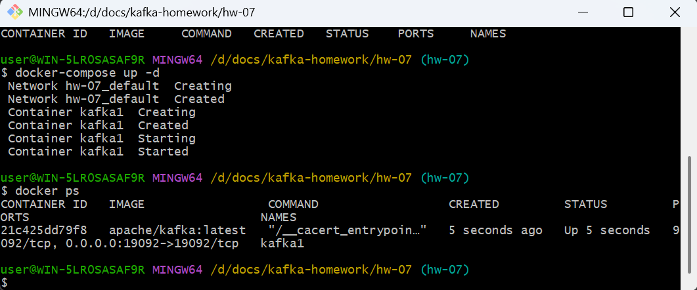

Пробуем создать и прочитать топик test1

`/opt/kafka/bin/kafka-topics.sh --bootstrap-server localhost:19092 --create --replication-factor 1 --partitions 1 --topic test1`

`/opt/kafka/bin/kafka-topics.sh --bootstrap-server localhost:19092 --describe`

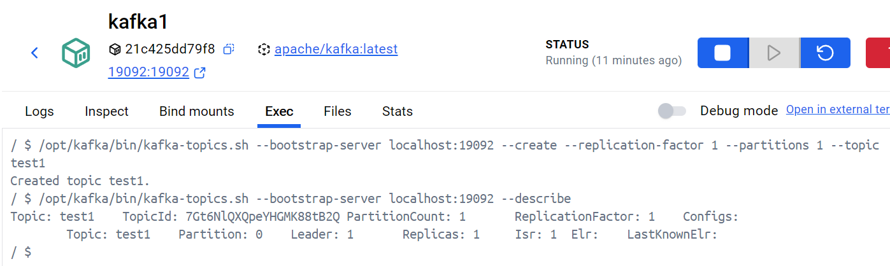

Генерируем uuid кластера

`/opt/kafka/bin/kafka-storage.sh random-uuid`

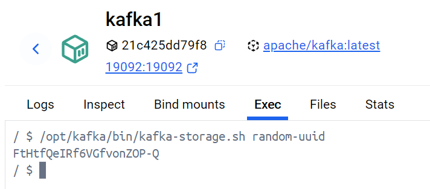

копируем результат и добавлям в параметры строку `CLUSTER_ID: 'FtHtfQeIRf6VGfvonZOP-Q'`

пересобираем контейнер и проверяем id кластера

`/opt/kafka/bin/kafka-cluster.sh cluster-id --bootstrap-server localhost:19092`

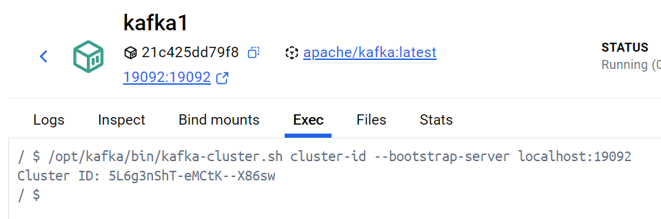


Подключаем внешние папки для логов в контейнер kafka1

```yml
    volumes:
      - ./kafka1-logs:/opt/kafka/logs
      - ./kafka1-kraft-combined-logs:/tmp/kraft-combined-logs
```
Папку `kafka1-kraft-combined-logs' форматируем с указанием CLUSTER_ID (конфиг берем локальный, меняем путь к папке логов на локальный)

`/opt/kafka/bin/kafka-storage.sh format --ignore-formatted -t FtHtfQeIRf6VGfvonZOP-Q -c /opt/kafka/config/server.properties`

В docker-compose добавляем ID нужного кластера `CLUSTER_ID: 'FtHtfQeIRf6VGfvonZOP-Q'`

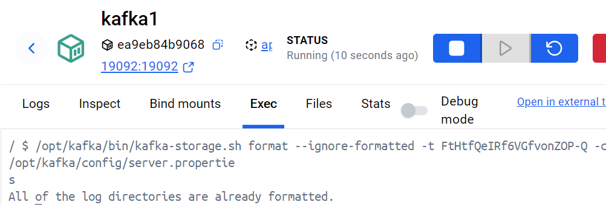


Добавим контейнер с ролью брокер на порт 29092

```yml
  kafka2:
    image: apache/kafka:latest
    container_name: kafka2
    ports:
      - "29092:29092"
    environment:
      KAFKA_NODE_ID: 2
      KAFKA_PROCESS_ROLES: 'broker'
      KAFKA_LISTENERS: 'PLAINTEXT://:9092,PLAINTEXT_HOST://:29092'
      KAFKA_ADVERTISED_LISTENERS: 'PLAINTEXT://broker1:9092,PLAINTEXT_HOST://host.docker.internal:29092'
      KAFKA_INTER_BROKER_LISTENER_NAME: 'PLAINTEXT'
      KAFKA_CONTROLLER_LISTENER_NAMES: 'CONTROLLER'
      KAFKA_LISTENER_SECURITY_PROTOCOL_MAP: 'CONTROLLER:PLAINTEXT,PLAINTEXT:PLAINTEXT,PLAINTEXT_HOST:PLAINTEXT'
      KAFKA_CONTROLLER_QUORUM_VOTERS: '1@kafka1:9093'
      KAFKA_GROUP_INITIAL_REBALANCE_DELAY_MS: 0
      CLUSTER_ID: 'FtHtfQeIRf6VGfvonZOP-Q'
    depends_on:
      - kafka1
    volumes:
      - ./kafka2-logs:/opt/kafka/logs
 
 ```

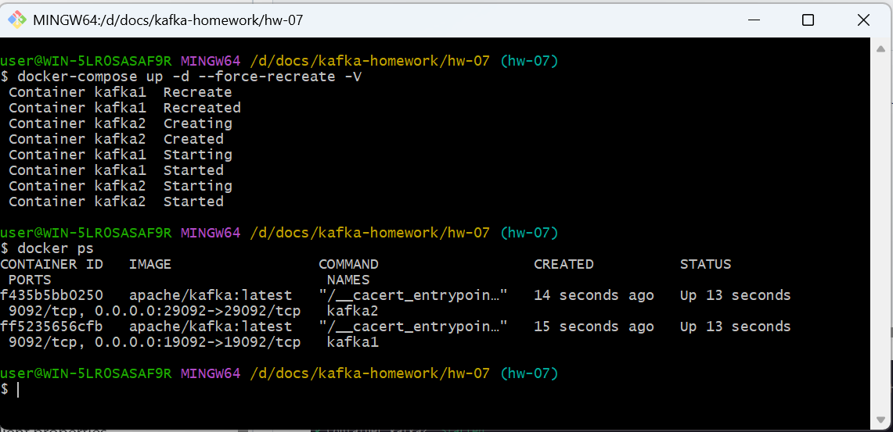

Добавляем в контейнеры настройки авторизации

```yml
      KAFKA_AUTHORIZER_CLASS_NAME: org.apache.kafka.metadata.authorizer.StandardAuthorizer
      KAFKA_SUPER_USERS: "User:admin"
      KAFKA_ALLOW_EVERYONE_IF_NO_ACL_FOUND: "true"
      KAFKA_OPTS: "-Djava.security.auth.login.config=/opt/kafka/kafka_server_jaas.conf"
      KAFKA_SASL_ENABLED_MECHANISMS: 'PLAIN'
      KAFKA_SASL_MECHANISM_INTER_BROKER_PROTOCOL: 'PLAIN'
```

правим параметр  
`KAFKA_LISTENER_SECURITY_PROTOCOL_MAP: 'CONTROLLER:PLAINTEXT,PLAINTEXT:PLAINTEXT,PLAINTEXT_HOST:PLAINTEXT'`
на
`KAFKA_LISTENER_SECURITY_PROTOCOL_MAP: 'CONTROLLER:PLAINTEXT,PLAINTEXT:PLAINTEXT,PLAINTEXT_HOST:SASL_PLAINTEXT'`

создаем файл с пользователями  `kafka_server_jaas.conf`

создаем админский конфиг `admin.properties`

Запускаем контейнеры и пробуем создать топик test1 без админского конфига

запрос `/opt/kafka/bin/kafka-topics.sh --bootstrap-server localhost:19092 --create --replication-factor 1 --partitions 1 --topic test1`

зависает, выходит по таймауту.
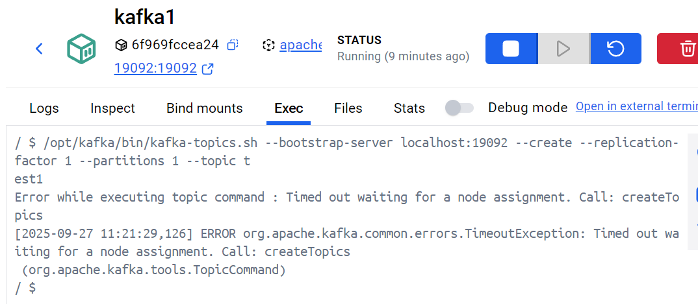

Ошибка в логах:

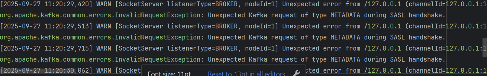

добавляем конфиг `--command-config /opt/kafka/conf/admin.properties` и повторяем операцию

теперь топик создался без ошибок
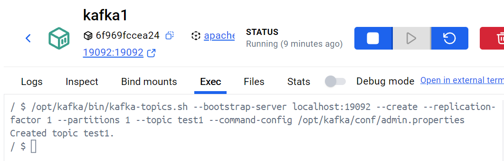

Создаем файлы авторизации клиентов Alice, Bob, client

Выдаем пользователю Alice право на чтение из топика test1

`/opt/kafka/bin/kafka-acls.sh --bootstrap-server localhost:19092 --add --allow-principal User:Alice --operation Read --topic test1 --command-config /opt/kafka/conf/admin.properties
`

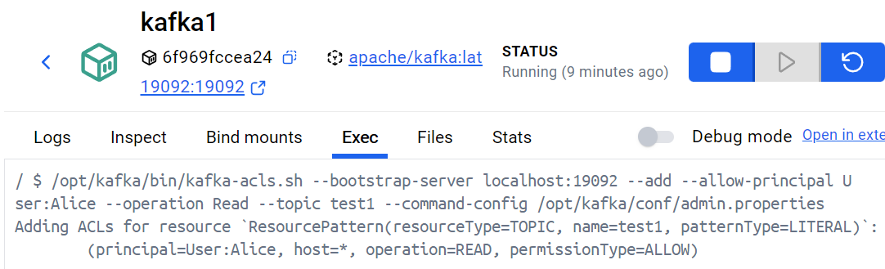

Выдаем пользователю Bob права на запись в топик test1

`/opt/kafka/bin/kafka-acls.sh --bootstrap-server localhost:19092 --add --allow-principal User:Bob --operation Write --topic test1 --command-config /opt/kafka/conf/admin.properties`

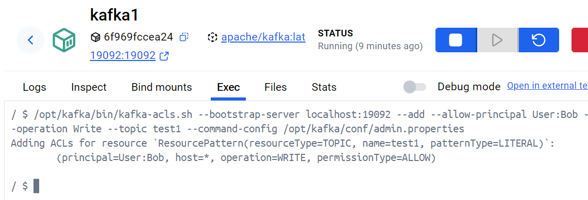

Тестируем просмотр списка топиков разными пользователями

```shell

/opt/kafka/bin/kafka-topics.sh --list --bootstrap-server localhost:19092 --command-config /opt/kafka/conf/client-client.properties
/opt/kafka/bin/kafka-topics.sh --list --bootstrap-server localhost:19092 --command-config /opt/kafka/conf/alice-client.properties
/opt/kafka/bin/kafka-topics.sh --list --bootstrap-server localhost:19092 --command-config /opt/kafka/conf/bob-client.properties


```
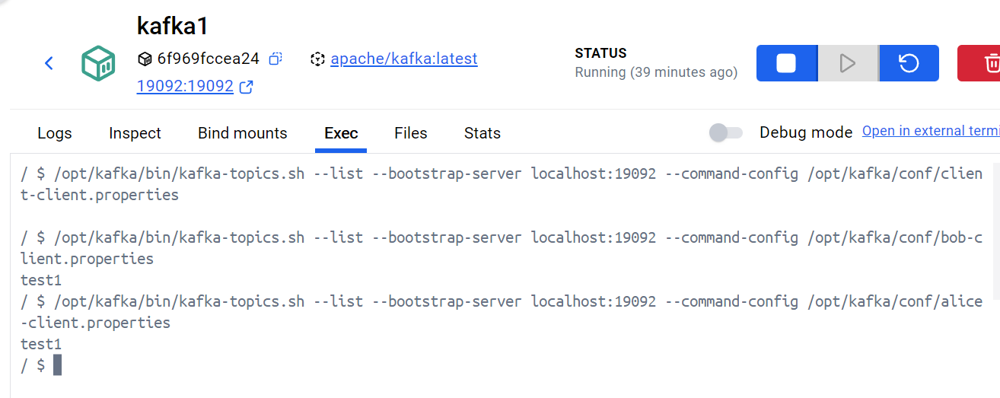

Топик test1 виден для Bob и Alice. Для пользователя client топик test1 недоступен.


Пробуем записать сообщение в топик от разных пользователей

```shell
/opt/kafka/bin/kafka-console-producer.sh --bootstrap-server localhost:19092 --topic test1 --producer.config /opt/kafka/conf/client-client.properties
/opt/kafka/bin/kafka-console-producer.sh --bootstrap-server localhost:19092 --topic test1 --producer.config /opt/kafka/conf/alice-client.properties
/opt/kafka/bin/kafka-console-producer.sh --bootstrap-server localhost:19092 --topic test1 --producer.config /opt/kafka/conf/bob-client.properties
/opt/kafka/bin/kafka-console-producer.sh --bootstrap-server localhost:19092 --topic test1 --producer.config /opt/kafka/conf/admin.properties

```

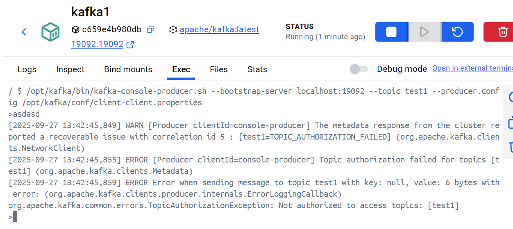

client не имеет доступа к топику

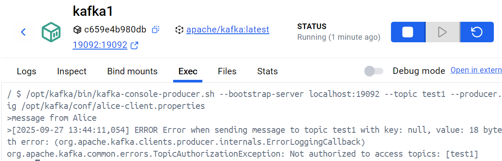

Alice не может писать в топик.

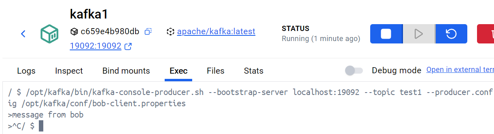

Bob успешно записал сообщение в топик

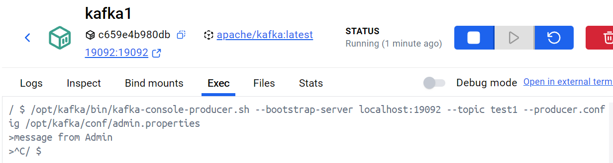

Admin успешно записал сообщение в топик

Пробуем прочитать сообщения

```shell
/opt/kafka/bin/kafka-console-consumer.sh --bootstrap-server localhost:19092 --topic test1 --consumer.config /opt/kafka/conf/client-client.properties -from-beginning
/opt/kafka/bin/kafka-console-consumer.sh --bootstrap-server localhost:19092 --topic test1 --consumer.config /opt/kafka/conf/alice-client.properties -from-beginning
/opt/kafka/bin/kafka-console-consumer.sh --bootstrap-server localhost:19092 --topic test1 --consumer.config /opt/kafka/conf/bob-client.properties -from-beginning
/opt/kafka/bin/kafka-console-consumer.sh --bootstrap-server localhost:19092 --topic test1 --consumer.config /opt/kafka/conf/admin.properties -from-beginning

```
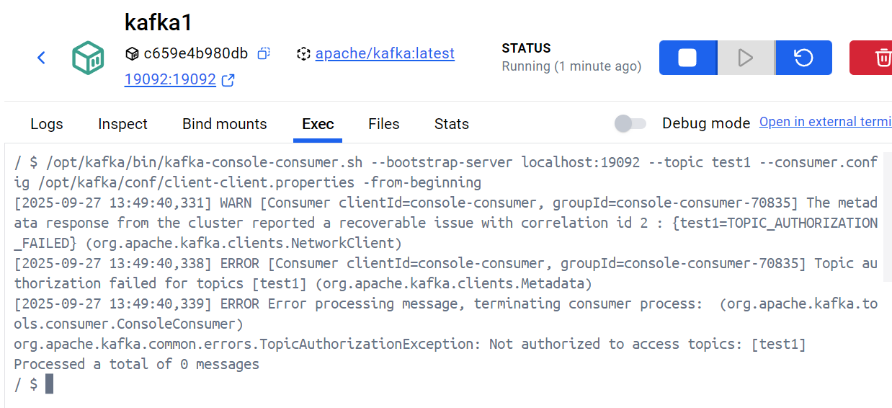

Client получил отказ.

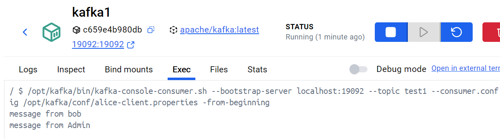
Alice прочла 2 сообщения

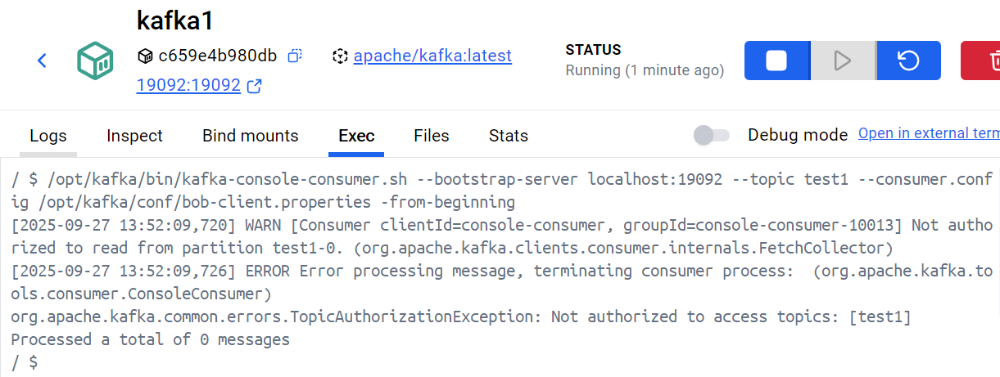

Bob получил отказ.

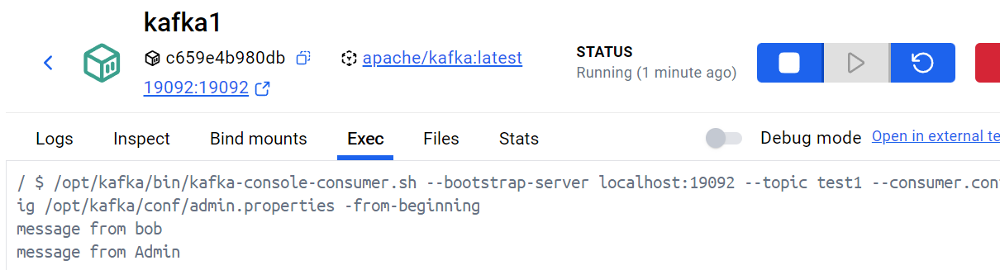

Admin получил 2 сообщения.