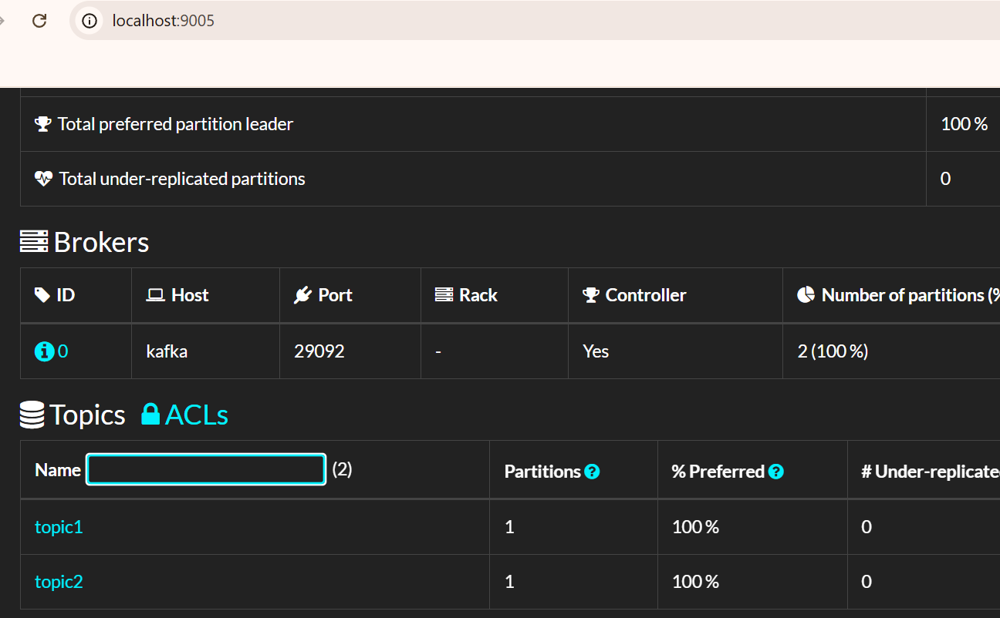
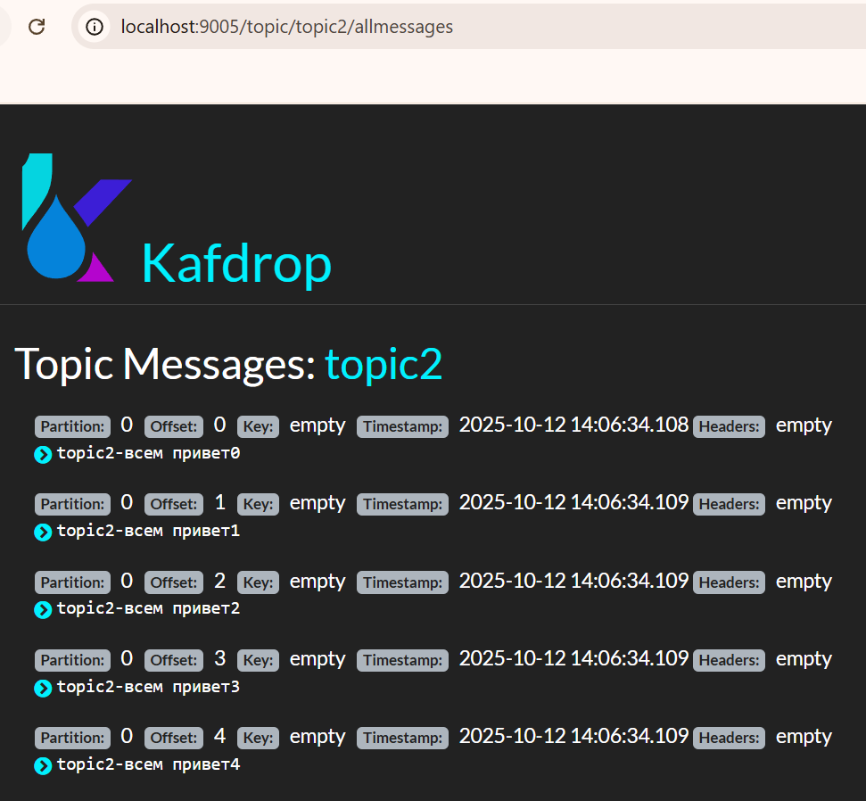

# kafka-homework

## Текст задания
Описание/Пошаговая инструкция выполнения домашнего задания:

    Описание/Пошаговая инструкция выполнения домашнего задания:
        Запустить Kafka
        Создать два топика: topic1 и topic2
        Разработать приложение, которое:
        открывает транзакцию
        отправляет по 5 сообщений в каждый топик
        подтверждает транзакцию
        открывает другую транзакцию
        отправляет по 2 сообщения в каждый топик
        отменяет транзакцию
        Разработать приложение, которое будет читать сообщения из топиков topic1 и topic2 так, чтобы сообщения из подтверждённой транзакции были выведены, а из неподтверждённой - нет.


## Домашнее задание к уроку 11

Запускаем 1 экземпляр kafka на порту 9092 и для контроля kafdrop на порту 9005
Создаем 2 топика




Создаем продюсер в отдельном классе KafkaProducer, в настройках для транзакций добавляем `TRANSACTIONAL_ID_CONFIG`

```java
kafkaProducer.initTransactions();
        kafkaProducer.beginTransaction();
        for (int i = 0; i < 5; i++) {
log.info("отправка сообшения id {} в topic1", i);
            kafkaProducer.send(new ProducerRecord<>("topic1", "topic1-всем привет" + i));
kafkaProducer.send(new ProducerRecord<>("topic2", "topic2-всем привет" + i));
}

kafkaProducer.commitTransaction();
log.info("коммитим транзакцию");
```

Отправляем по 5 сообщений в оба топика и коммитим их.

```java
producer2.initTransactions();
producer2.beginTransaction();
for (int i = 0; i < 2; i++) {
    log.info("Отсылаем сообщение id {} в топики и далее откатим их", i);
    producer2.send(new ProducerRecord<>("topic1", "topic1 message-откатим транзакцию" + i));
    producer2.send(new ProducerRecord<>("topic2", "topic2 message-откатим транзакцию" + i));
}
producer2.flush();
producer2.abortTransaction();
log.info("send и далее abort abortTransaction");
```

Видим, что в обоих топиках есть отправленние сообщения.

topic-1

topic-2


Далее отправляем по 2 сообщения в оба топика и откатываем транзакцию.

```java
roducer2.initTransactions();
producer2.beginTransaction();
for (int i = 0; i < 2; i++) {
    log.info("Отсылаем сообщение id {} в топики и далее откатим их", i);
    producer2.send(new ProducerRecord<>("topic1", "topic1 message-откатим транзакцию" + i));
    producer2.send(new ProducerRecord<>("topic2", "topic2 message-откатим транзакцию" + i));
}
producer2.flush();
producer2.abortTransaction();
log.info("send и далее abort abortTransaction");
```

Смотрим результат - откаченных сообщений в топиках не появилось.

topic-1

topic-2



