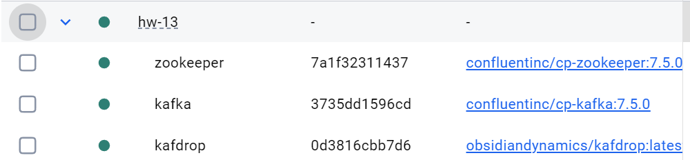
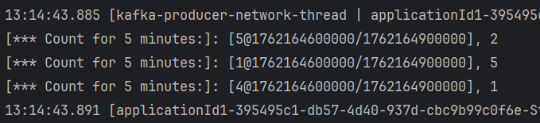

## Задание

Разработка приложения Kafka Streams:

    Запустить Kafka
    Создать топик events
    Разработать приложение, которое подсчитывает количество событий с одинаковыми key в рамках сессии 5 минут
    Для проверки отправлять сообщения, используя console producer.


## Домашнее задание к уроку 13


Запускаем кафку и создаем events




Создаем класс для работы с kafka streams `main/java/ru/otus/KafkaStreamsService.java`

```java
        try {
        log.info("Application Started");
            kafkaStreams.start();
            latch.await();
            log.info("Application shutting down");
        } catch (Throwable e) {
        System.exit(1);
        }
                System.exit(0);
```

Создаем основной поток

```java

        var builder = new StreamsBuilder();

        KStream<String, String> originalStream = builder.stream("events", Consumed.with(stringSerde, stringSerde));

```


Выводим все входящие сообщения в консоль с меткой `From my apps`

```java

    originalStream.print(Printed.<String, String>toSysOut().withLabel("From my apps"));


```


Переводим поток в оконную таблицу и считаем количество событий с одинаковыми key в рамках сессии 5 минут

```java

var newTable = originalStream
        .groupByKey()
        .windowedBy(TimeWindows.ofSizeWithNoGrace(Duration.ofMinutes(5)))
        .count();


```

Переводим таблицу обратно в поток и выводим в консоль с новой меткой `Count for 5 minutes:`

```java

newTable.toStream().print(Printed.<Windowed<String>, Long>toSysOut().withLabel("Count for 5 minutes:"));


```

Запускаем приложение и начинаем отправлять сообщения в топик консольным продюсером

`docker exec -it 3735dd1596cd /usr/bin/kafka-console-producer --bootstrap-server localhost:9092 --topic events --property "parse.key=true" --property "key.separator=:"`


Через 5 минут после начала отправки сообщений в консоли выводится результат

